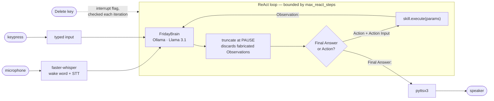

# FRIDAY

[](https://github.com/GovindRajoria/friday-assistant/actions/workflows/ci.yml)

A voice-driven desktop assistant that runs entirely on local hardware. Speech recognition, reasoning, and text-to-speech all execute on-device — there is no cloud API in the loop, and no audio or camera data leaves the machine.

The interesting part is not the voice interface; it is the reasoning loop. FRIDAY implements **ReAct** (Reason + Act) on top of a local Llama 3.1 via Ollama, so it can chain several tools together to answer one request — search the web, do arithmetic internally, write the result to a document, then commit a note to long-term memory — deciding each step from the outcome of the last one.

Built May 2026.

---

## How it works



Everything in that diagram runs on the machine it is installed on. No audio,
frame, or transcript is sent anywhere.

### The reasoning loop

`core/brain.py` builds a system prompt containing a JSON manifest of every loaded skill — name, description, required parameters — then asks the model to emit a strict `Thought → Action → Action Input → PAUSE` sequence. `analyze_intent()` parses that response and hands the chosen tool and its parameters back to `core/main.py`, which executes the skill and feeds the result to `resume_react()` as an `Observation`. The model then either calls another tool or emits `Final Answer:` and the loop exits.

Two details that took iteration to get right:

- **Hallucinated observations.** Left alone, the model happily writes its own `Observation:` line and continues reasoning against invented data. The fix is truncating every response at the `PAUSE` token (`brain.py`), which physically discards anything the model tried to fabricate past the point where it was supposed to yield control.
- **Runaway loops.** `max_react_steps` bounds the reasoning cycle, so a model that never reaches a conclusion aborts with an explanation instead of spinning.

### Skill discovery

`core/main.py` walks `skills/` with `rglob("*.py")`, imports each module, and calls its `setup()`. Whatever comes back is registered under its `manifest["name"]`. Adding a capability means dropping a file into `skills/` — no registry to edit, no imports to wire up.

The registry is keyed by manifest name, so **two skills declaring the same name silently overwrite each other**. Keep names unique — `tools/check_manifests.py` enforces it, and CI runs it on every push:

```bash
cd FRIDAY_CORE && python tools/check_manifests.py
```

It reads the manifests with `ast` rather than importing them, so it needs none of the runtime dependencies and works on a machine with no model, no microphone and no camera.

### Interrupts

`core/interrupt_handler.py` runs a global `pynput` keyboard listener. Pressing **Delete** mid-thought sets a flag the ReAct loop checks on every iteration, so a reasoning chain that has gone off the rails can be killed without terminating the process.

---

## Writing a skill

A skill is a class with a `manifest`, an `execute()` method, and a module-level `setup()` factory:

```python
class WeatherSkill:
    def __init__(self):
        self.manifest = {
            "name": "check_weather",          # unique; the LLM calls this
            "description": "Fetches the current forecast for a named city. "
                           "Use this only for weather questions.",
            "parameters": ["city"],
        }

    def execute(self, params=None):
        city = (params or {}).get("city")
        if not city:
            return {"status": "error", "message": "I need a city name."}
        return {"status": "success", "message": f"It is 22 degrees in {city}."}


def setup():
    return WeatherSkill()
```

`execute()` must return a dict with `status` and `message`. The `message` is what the model receives as its `Observation`, so it should read as a sentence, not a data structure.

**The `description` field is the routing logic.** It is the only information the model has when deciding whether to call your skill, and vague descriptions cause misrouting — which is why several of the shipped manifests contain explicit negative instructions ("DO NOT use this to open applications"). Treat it as prompt engineering, not documentation.

---

## Included skills

| Skill | What it does |
|---|---|
| `scan_environment` | Captures a webcam frame and runs YOLO11 object detection through OpenVINO |
| `web_search` | Scrapes DuckDuckGo Lite and has the model extract the factual answer |
| `manage_memory` | Stores and retrieves facts in a local SQLite vault, synthesising a natural reply on retrieval |
| `draft_document` | Generates prose with the local model and saves it as a `.docx` |
| `launch_application` | Opens desktop applications, with per-OS executable name mapping |
| `media_control` | System volume and playback control (Windows) |
| `system_check` | CPU and RAM utilisation |
| `log_fleet_market_data` | Appends structured rows to a CSV ledger |
| `core_identity` | Answers "who are you" without burning a reasoning step |

---

## Setup

**Prerequisites:** Python 3.10, [Ollama](https://ollama.com) running locally, a microphone, and a webcam for the vision skill.

```bash
git clone https://github.com/GovindRajoria/friday-assistant.git
cd friday-assistant/FRIDAY_CORE

# Installs system dependencies, Ollama, the model, and the Python environment
bash skills.sh
```

Or manually:

```bash
python -m venv friday_env
source friday_env/bin/activate      # Windows: friday_env\Scripts\activate
pip install -r requirements.txt
ollama pull llama3.1
```

**Configure.** Copy the example settings and edit them:

```bash
cp config/settings.example.yaml config/settings.yaml
```

`config/settings.yaml` is git-ignored — it holds your name, microphone index, and camera index, none of which belong in version control. Every value falls back to a default in `core/config.py`, so an empty file still boots.

**Generate the vision model.** The YOLO weights and the exported OpenVINO IR are not committed (they are regenerable, and one is 10 MB):

```bash
python benchmarks/openvino_yolo11_opt.py
```

This downloads `yolo11n.pt`, exports it to OpenVINO IR in `yolo11n_openvino_model/`, and benchmarks the result.

**Run:**

```bash
python -m core.main
```

Say the wake word, or press any key to type a command instead.

---

## Platform support

Developed and tested on Windows 11 with Python 3.10.

The core loop, vision, web search, memory, and document skills are cross-platform. Two areas are not:

- **`media_control`** drives Windows media keys and the CoreAudio COM interface. On Linux and macOS the skill loads but returns a clear error rather than vanishing from the registry.
- **Keyboard-interrupt detection in `core/listener.py`** uses `msvcrt` on Windows and falls back to a `select` poll on stdin elsewhere. The fallback is untested.

---

## Repository layout

```
FRIDAY_CORE/
├── core/
│   ├── main.py              Entry point: skill discovery, the ReAct ping-pong loop
│   ├── brain.py             Ollama client, prompt construction, response parsing
│   ├── config.py            Settings loader with layered fallbacks
│   ├── listener.py          faster-whisper STT + wake word + typed-input fallback
│   ├── speaker.py           pyttsx3 TTS
│   └── interrupt_handler.py Global kill-switch listener
├── skills/                  Auto-discovered capabilities, grouped by domain
├── benchmarks/              YOLO11 / OpenVINO export and latency measurement
├── tools/
│   └── check_manifests.py   Static manifest validation; what CI runs
├── config/
│   └── settings.example.yaml
├── requirements.txt
└── skills.sh                Cross-platform bootstrap
```

Design decisions and the reasoning behind them: [docs/DESIGN.md](docs/DESIGN.md).

---

## Known limitations

Stated plainly, because they are the honest state of the project:

- Prompt-based tool routing is brittle. The model occasionally appends prose to an `Action:` line or invents a tool that does not exist; the guardrails in `brain.py` catch the common failure modes but not all of them.
- `media_control` sets volume by simulating 50 `volumedown` keypresses and stepping back up, because it assumes Windows' fixed 2% increments. It works, but it is a workaround for driver-state issues rather than a clean solution.
- Speech recognition runs `base.en` on CPU with `int8` quantisation, chosen for latency over accuracy.
- **Nothing that needs a model, a microphone or a camera is tested.** CI lints, compiles, and validates every skill manifest — real gates, but static ones. The reasoning loop, speech recognition, and every skill's `execute()` are exercised only by hand.
- `test_suite.txt` drives an end-to-end batch runner (`run the test suite`) that logs model output for manual review — useful for regression-spotting, not a substitute for unit tests.

---

## Licence

**GNU AGPL-3.0** — see [LICENSE](LICENSE).

This project uses [Ultralytics YOLO](https://github.com/ultralytics/ultralytics) for object detection, which is licensed under AGPL-3.0. Because FRIDAY loads Ultralytics at runtime, the combined work inherits AGPL-3.0 terms; the licence choice here follows from that dependency. If you need permissive licensing, substitute the detector in `skills/vision/scan_environment.py`.

## Author

**Govind Kumar** — AI/ML Developer, Metro Infrasys Private Limited
[GitHub](https://github.com/GovindRajoria) · govindrajoria97@gmail.com
